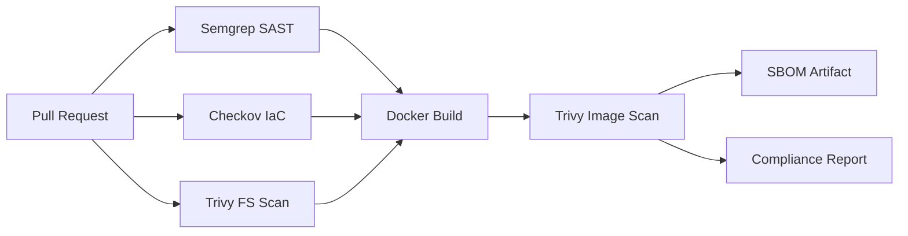

# DevSecOps Pipeline

Production-style CI/CD with **SAST**, **IaC scanning**, **container scanning**, and **compliance reporting**.

## Problem

Teams merge code without consistent security gates. This repo demonstrates automated checks on every pull request.

## Architecture



## Features

- Semgrep SAST on application code
- Checkov on Terraform (when added)
- Trivy filesystem + container scanning
- Trivy image scan (CRITICAL/HIGH reported; SARIF artifact on `main`)
- Compliance report artifact on `main`

## Quick start

```powershell
# Run app locally
cd app
pip install -r requirements.txt
python app.py

# Build and scan locally
make build
make scan
```

## Demo

1. Open a PR with a deliberate vulnerability (e.g. hardcoded secret in `app/`)
2. Watch CI fail on Semgrep/Trivy
3. Fix → green pipeline

## Security

- No secrets in repository
- Branch protection: require CI pass before merge
- See `docs/security.md`

## Cost

**$0** — runs on GitHub Actions free tier for public repos.

## Author

MS Cybersecurity · Lead DevOps Engineer
